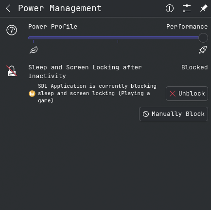
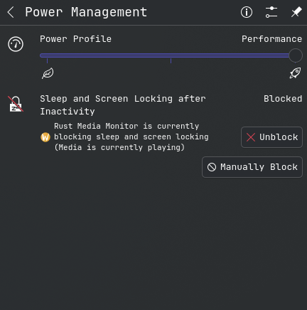
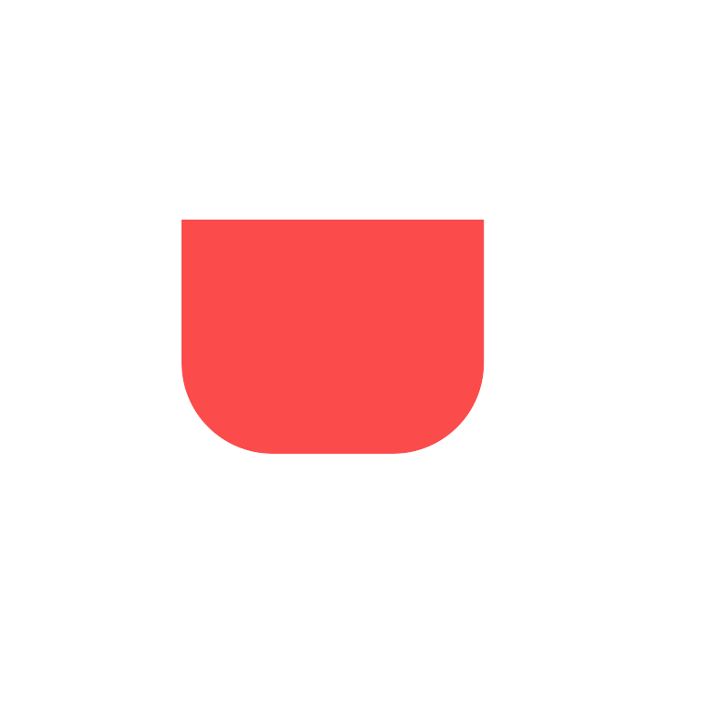

## THIS IS A PROOF OF CONCEPT PROJECT TO LEARN RUST

The code is probably shocking, and non-standard for a production grade codebase.
I do not intend for this to work on a machine other than mine, so I cannot provide any guarantee on the safety,
security, reliability or compatability that the code works on your machine as expected and does not break anything
if downloaded and executed.

# System Requirements

APP may require Arch based OS and KDE Plasma desktop environment, however this is unverified.

# Design Goal

When actively playing a video or listening to music in the background as my computer's only task,
I noticed that my screen should go dark and eventually go into sleep mode.
I was able to determine that some applications like games would block the screen from sleeping inside KDE's power
management.

However, applications like spotify, VLC and YouTube tabs were not blocking my computer from automatically sleeping.
How weird, yet interesting!

This discovery lead to the decision to both, learn how to code in rust for the first time, and to design a solution that
blocks the screen when any media is playing. The decision was motivated by my recent switch from Windows to Linux (
Endeavour OS + KDE Plasma).
Surely I should be able to implement something that does this right?

Turns out the answer is a resounding YES!!!

# High Level Overview

1. Registers a listener and waits for a signal/interrupt on any added/removed media players (e.g. Spotify, Chrome, VLC)
2. Registers a listener for each of the media players and waits for a signal/interrupt on any changes in their playback
   status (Playing, Paused,
   Stopped)
3. If any media player is current playing, then block the screensaver from sleeping the PC
4. Otherwise, allow the screensaver to auto-sleep the PC

# System Tray Icon Colours

The system tray allows for understanding the status of the blocker at a glance

### RED

Application has been manually blocked by the user via the System Tray menu toggle

### ORANGE

Application is currently idle and not blocking the screensaver from auto-sleeping the PC

### GREEN

Application is currently active and blocking the screensaver from sleeping the PC

# Reference Images

- Coffee Cup: https://github.com/Iconscout/unicons/blob/master/svg/line/coffee.svg